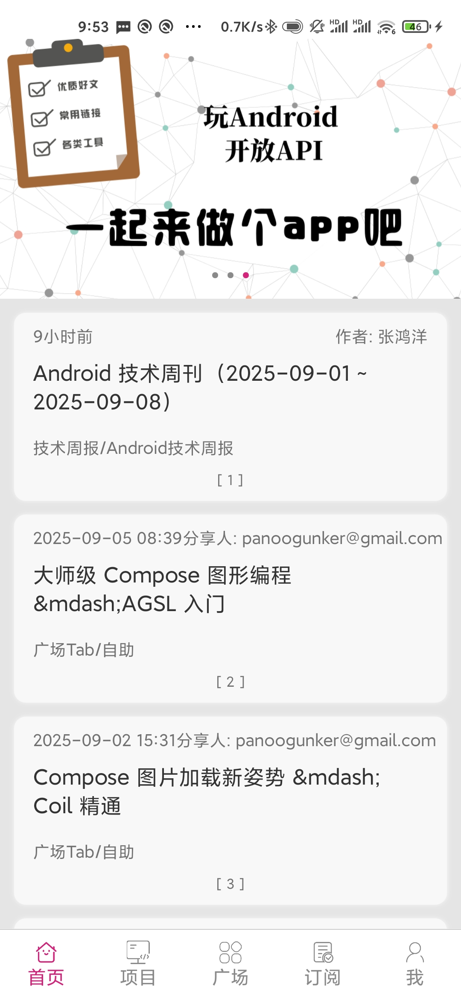
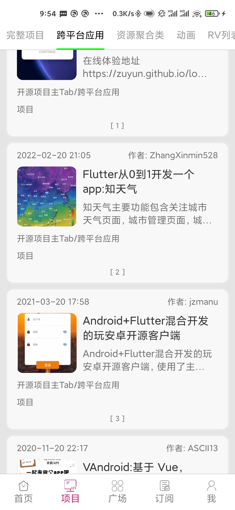
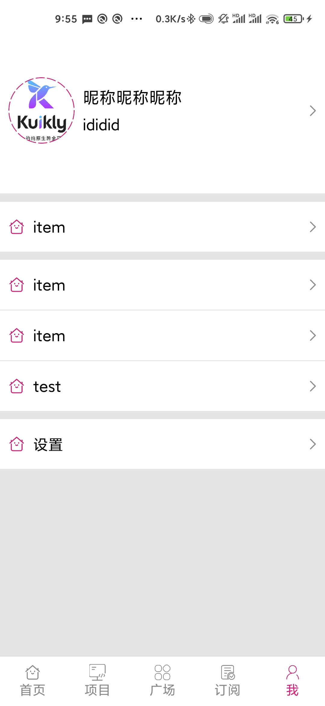

效果图

<div style="display: flex; justify-content: space-between;">
    
    
    
</div>

---

# WanKuikly

当前使用版本

- Kuikly 2.4.0
- Kotlin 2.0.21
- Kotlin OHOS 2.0.21-KBA-004

当前只在 Android 平台正常运行，未调试其它平台

---

在插件模板创建项目之后，
使用到的库

common
- `kotlinx-serialization`
- `kuiklyx-coroutines` 目前还有问题
- `ktor-client-core` + KMP
  - `ktor-client-okhttp`
  - `ktor-client-darwin`
  - `ktor-client-js`
  - `ktor-client-java`

android
- `Toaster`

---

todo，待完成

- 搜索页面
- 页面管理
- pref 封装管理
- 网络请求封装 统一处理
- 架构分层
- WebView 实现

---

存在的问题

- 使用 kotlinx-serialization 后 h5App 运行失败
- Ktor 网络请求后更新数据，大概率会报错，用回 networkModel
- 很多地方 Kuikly 模板只提供接口，确认各个平台功能实现情况

- Input 无法清除焦点光标
- 关闭软键盘未实现
- WebView 支持
- html 解析，类似 Android 的 Html.fromHtml 那种
- 多个容器高度设置 0.5f，显示不一致，多个分割线大小不一致，在模拟器上 1f 也大小不一致
- ListPage 懒加载优化
- Android API 未适配到最新版，最高支持 34

---

写 Bug 心得

- ComposeView，插件创建的类是通过 addChild 添加的，在构建对象时传递参数，view创建时会调用一次。可以先传一个引用，之后更新这个引用的数据
- ComposeView，需要自己指定对齐方式，上级 View 的对齐方式可能不生效

---

## Android

KuiklyTemplate 1.2.0

- KSP 版本与 Kotlin 版本不对应，需要手动修改
- AGP 7.4.2 最高支持 api 33，实际测试 api 34 可以运行
- 打包提示 dex 或 merge 相关错误，设置 `isMinifyEnabled = true` 可正常编译

## iOS

无

## OHOS

截至 0823, OHOS 仅支持 MacOS 编译

编译或运行前，需要手动复制 assets 资源

```
cp shared/src/commonMain/assets ohos/entry/src/main/resource/resfile
```

- 使用独立编译链，即使用带 ohos 的构建脚本

```
./gradlew -c settings.ohos.gradle.kts :shared:linkOhosArm64
```

```
cp build/bin/ohosArm64/releaseShared/libshared.so ohosApp/entry/libs/arm64-v8a/libshared.so
cp build/bin/ohosArm64/releaseShared/libshared_api.h ohosApp/entry/src/main/cpp/libshared_api.h
```

- 或在 DevEco 运行，会使用 hvigor 脚本执行编译命令，并复制 so 和头文件到 ohosApp 中

ohosApp 的 local.properties 配置相关变量

```
# kuiklyCompilePlugin
kuikly.projectPath=../
kuikly.moduleName=shared
kuikly.ohosGradleSettings=settings.ohos.gradle.kts

# OPTIONAL Parameters
#kuikly.soPath=Your so product path(Relative path to the Ohos project root directory, the default is entry/libs/arm64-v8a)
#kuikly.headerPath=Your header product path(Relative path to the Ohos project root directory, the default is entry/src/main/cpp)
```

## MiniApp

npm 配置 包安装

```
# npm 换源
npm config set registry https://registry.npmmirror.com
```

```
cd static_server
# 安装
npm install
```

运行开发服务器

```
# 运行 shared 项目 dev server 服务器，没有安装 npm 包则先 npm install 安装一下依赖
npm run serve

#  构建 shared 项目 Debug 版
./gradlew :shared:packLocalJsBundleDebug
```

构建 miniApp 项目

```
#  运行 miniApp 服务器 Debug 版
./gradlew :miniApp:jsMiniAppDevelopmentWebpack
```

构建 release 版本

```
# 首先构建业务 Bundle
./gradlew :demo:packLocalJSBundleRelease

# 然后构建 miniApp
./gradlew :miniApp:jsMiniAppProductionWebpack
```

使用微信小程序开发者工具打开miniApp下的dist目录，
修改app.json里面的pages数组和在pages里新建对应的页面（改为项目这里的页面）

```
// 例如demo里存在router的Page, 就需要在app.json的pages数组里添加 "pages/router/index", 同时在pages的目录里新建router目录补充和pages/index目录一样的内容

// pages/index/index.js内容
var render = require('../../lib/miniApp.js')
render.renderView({
    // 这里的pageName是最高优先级，如果没配置，会去拿微信小程序启动参数里的page_name，如果都没有会报错
    // 建议微信小程序的第一个页面必须配置pageName
    // pageName: "router",
    statusBarHeight: 0 // 如果要全屏，需要把状态栏高度设置为0
})
```

复制本地静态资源

```
// 复制业务的assets文件到微信小程序目录
./gradlew :miniApp:copyAssets
```

## H5App

npm 配置 包安装

```
# npm 换源
npm config set registry https://registry.npmmirror.com

# 安装
npm install
```

运行开发服务器

```
# 运行 shared 项目 dev server 服务器，没有安装 npm 包则先 npm install 安装一下依赖
npm run serve

#  构建 shared 项目 Debug 版
./gradlew :shared:packLocalJsBundleDebug
```

构建运行 h5App 项目

```
#  运行 h5App 服务器 Debug 版
./gradlew :h5App:jsBrowserRun -t
kotlin 2.0 以上运行: 
./gradlew :h5App:jsBrowserDevelopmentRun -t

如果window平台因为编译iOS模块失败，可以参考"快速开始-环境搭建"指引配置
# 拷贝 assets 资源到 dev server
./gradlew :h5App:copyAssetsToWebpackDevServer
```

只构建 h5App 产物，不运行开发服务器

```
#  构建 h5App webpack 打包 Debug 版
./gradlew :h5App:jsBrowserDevelopmentWebpack
#  构建 h5App webpack 打包 Release 版
./gradlew :h5App:jsBrowserProductionWebpack
```

项目发布

```
# 构建业务 h5App 和 JSBundle
# 首先构建业务 Bundle
./gradlew :shared:packLocalJSBundleRelease
# 然后构建宿主 APP
./gradlew :h5App:publishLocalJSBundle
```
